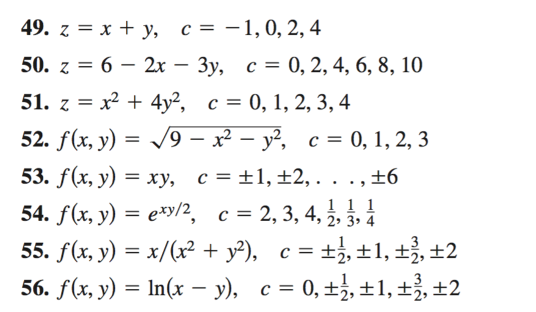

```{r knitr_init, echo=FALSE, cache=FALSE}
library(knitr)
library(rmdformats)

## Global options
options(max.print="75")
opts_chunk$set(echo=TRUE,
	             cache=TRUE,
               prompt=FALSE,
               tidy=TRUE,
               comment=NA,
               message=FALSE,
               warning=FALSE)
opts_knit$set(width=75)
```

# Subindexado de vectores atómicos

El subindexado de vectores atómicos permite obtener partes de un vector atómico (los primeros elementos, los 10 últimos, etc.) y es útil en muchos tipos de análisis que suceden en diversas ramas de la ciencia. Supongamos que  tenemos lo siguiente:

```{r pressure, eval=TRUE}
dnormales <- rnorm(20)    # 10 numeros aleatorios de una dist. normal
dnormales   # Imprimimos el vector

```

## Ejercicios:
1.- ¿Cuál es el resultado de `dnormales[order(x)]`, `dnormales[1:length(vec)]`, `dnormales[-20]`, `dnormales[vec>0.5]`? 

- `dnormales[order(x)]`: Reordena los elementos del vector dnormales utilizando el orden que produciría ordenar el vector x de menor a mayor.
- `dnormales[1:length(vec)]`: Selecciona los primeros elementos de dnormales, donde la cantidad de elementos seleccionados es igual a la longitud del vector vec.

- `dnormales[-20]`: Devuelve todos los elementos de dnormales excepto el que se encuentra en la posición 20.

- `dnormales[vec>0.5]`: Selecciona los elementos de dnormales cuyas posiciones corresponden a valores de vec mayores que 0.5.

2.- ¿Qué sucede si hacemos `dnormales[0:3]`? ¿Cuál es la longitud del vector? 
La secuencia 0:3 genera los índices 0, 1, 2 y 3. En R, el índice 0 se ignora, por lo que únicamente se seleccionan las posiciones 1, 2 y 3 de dnormales. El vector resultante tiene una longitud de 3 elementos.

3.- Ahora suponga que `x <- c(1,24,8)` y `uno <- c(T,T,F)`. ¿Qué sucede si hacemos `x[uno]`? ¿Y si hacemos `x[as.double(uno)]`?

- `x[uno]`: Utiliza indexación lógica. Se seleccionan los elementos de x que corresponden a las posiciones donde uno tiene el valor TRUE.
- `x[as.double(uno)]`: Convierte los valores lógicos de uno a números (TRUE se convierte en 1 y FALSE en 0) y luego utiliza esos números como índices para acceder a los elementos de x. El índice 0 no selecciona ningún elemento.

# Subindexado de listas

Las listas se pueden subindexar mediante los operadores `[`, `[[` y `$`. Recordemos que cuando indexamos con `[`, el resultado siempre es del mismo tipo. Ahora suponga que tenemos la siguiente lista:

```{r, eval= TRUE}
listaPrueba <- list(Mayusculas = LETTERS[1:15], Ciudades = c("Cancun", "Playa", "Chetumal", "Merida"), casos = list(a=23, b= 1:8, c=list(d=1,e=TRUE)))
str(listaPrueba)
```

Ejercicios (en base al objeto `listaPrueba`),

1.- ¿Con qué comando puedo obtener la lista casos? Existen 2 formas: listaPrueba$casos y listaPrueba[[3]]

2.- ¿Cómo puedo obtener el único  valor lógico de `listaPrueba`? Existen 2 formas:

- listaPrueba$casos$c$e 
- listaPrueba[[3]]$c[[2]]

3.- ¿Qué sucede si hago `listaPrueba[[3]]$c[[2]]`, es esto equivalente a `listaPrueba$casos[[3]][[2]]`? Explique

- En el primer caso:
listaPrueba[[3]] obtiene la lista casos.
$c obtiene la sublista c.
[[2]] obtiene el segundo elemento de c, que es e = TRUE.

- En el segundo caso: listaPrueba$casos obtiene la lista casos.
[[3]] obtiene la sublista c.
[[2]] obtiene el segundo elemento de c, que es TRUE.

Ambos llegan al mismo valor

4.- ¿Cuál es la diferencia entre `listaPrueba[1]` y `listaPrueba[[1]]`?

- `listaPrueba[1]`: devuelve una lista que contiene el elemento Mayusculas.

Mientras que

- `listaPrueba[[1]]`: devuelve directamente el vector de letras almacenado en Mayusculas.

5.- ¿Cómo puedo obtener el objeto `"Chetumal"`? Existen 2 formas: listaPrueba$Ciudades[3] y listaPrueba[[2]][3]

6.- ¿Cómo puedo obtener el tercer elemento de `b`? Existen 2 formas: listaPrueba$casos$b[3] y listaPrueba[[3]]$b[3]


# Indexado de matrices


Suponga que tenemos la matriz:

```{r, eval=TRUE}
matriz1 <- matrix(rnorm(20), nrow=5)
dim(matriz1)
```

## Ejercicios:

A partir de `matriz1`, hallar:

1.- La matriz que consta de las primeras dos columnas de `matriz1`.

- matriz1[, 1:2]

Se seleccionan todas las filas (,) y las columnas 1 y 2 de la matriz.

2.- La matriz que consta de las primeras dos filas y dos columnas de `matriz1`.

- matriz1[1:2, 1:2]

Se seleccionan las filas 1 y 2, y las columnas 1 y 2.

3.- La matriz que consta del elemento $a_{2,3}$ de `matriz1`

- matriz1[2, 3]

Se obtiene el elemento ubicado en la fila 2 y columna 3 de la matriz.

4.- ¿Son equivalentes los comandos `matriz1[c(1,2),c(3,4)]` y `matriz1[1:2,c(3,4)]`? (tip: puede probar con el comando `identical`)

- identical(
  
  matriz1[c(1,2), c(3,4)],
  
  matriz1[1:2, c(3,4)])

- c(1,2) crea el vector (1, 2) y 1:2 también crea el vector (1, 2).

Como ambos seleccionan las mismas filas (1 y 2) y las mismas columnas (3 y 4), el resultado es exactamente la misma submatriz.

# Subindexado de `data.frame`

El subindexado de `data.frames` es similar al subindexado por medio de listas y matrices. En este caso nos concentraremos en el paquete `dplyr` que permite manipular `data.frames`. Cualquier paquete en `R` se puede instalar mediante el comando `install.packages(<nombre.paquete>)`, por ejemplo para instalar `dplyr` hacemos:

```{r, eval=FALSE}
install.packages("dplyr", dependencies = TRUE)   # instalo el paquete
library(dplyr)         # Cargo el paquete para trabajar con sus funciones

```

## Tarea:


1.- Investigar para qué sirve el paquete `dplyr`.

El paquete dplyr es una herramienta de R utilizada para manipular, transformar y analizar data.frames de forma sencilla y eficiente. Permite realizar operaciones comunes sobre datos usando una sintaxis más clara y fácil de leer que la de R base.

Con dplyr puedes:

- Seleccionar columnas.
- Filtrar filas.
- Ordenar datos.
- Crear nuevas variables.
- Agrupar datos.
- Resumir información estadística.

2.- ¿Cuáles son los comandos importantes del paquete `dplyr`?

Los más importantes son:

- select(): Selecciona columnas.
- filter(): Filtra filas según una condición.
- arrange(): Ordena filas.
- mutate():	Crea o modifica columnas.
- summarise(): o summarize()	Resume datos (media, suma, etc.).
- group_by():	Agrupa datos para análisis por categorías.
- rename():	Cambia nombres de columnas.
- distinct():	Elimina filas duplicadas.

3.- Supongamos que tenemos un `data.frame` `df <- data.frame(a=1:8, letras =letter[1:8])`, qué sucede si aplico `select(df, a)`. ¿Y si aplico `filter(df, a<5)`?

- `select(df, a)`: Selecciona únicamente la columna a del data.frame.

Resultado:

 a

1 1

2 2

3 3

4 4

5 5

6 6

7 7

8 8

- `filter(df, a<5)`: Filtra las filas donde el valor de la columna a sea menor que 5.

Resultado:

  a letras

1 1      a

2 2      b

3 3      c

4 4      d

# Gráficos de funciones bidimensionales

Los gráficos permiten mostrar múltiples características de una función. Los máximos, mínimos, etc., son métricas que nos dicen mucho acerca del comportamiento de una función. `R` nos permite graficar funciones de manera sencilla utilizando el concepto de vector. Por ejemplo, quizás estemos interesados en conocer la forma de onda de la función seno acotada, la cual se define matemáticamente mediante la siguiente fórmula:

$$
f(t) = \begin{cases}
\sin(2 \pi t) & \mbox{para} -1 < t < 1\\
0 & \mbox{resto}.
\end{cases}
$$
Y la cual en `R` se grafica de la siguiente manera:

```{r eval=TRUE}

t  <- seq(-1, 1, length=100)
ft   <- sin(2*pi*t)           # Se calcula la funcion seno a partir de t
plot(t, ft, type="l", xlim=c(-4,4), ylim=c(-1.5,1.5), main="Funcion seno", xlab="tiempo", ylab="Valores")
grid()

```

`R` permite añadir gráficos o puntos mediante las funciones `lines()` y `points()`. El siguiente código ejemplifica lo anterior.

```{r eval=T}
t  <- seq(-3,3, length=200)
f1 <- sin(2*pi*(t))
f2 <- sin(2*pi*(t-1/4))
f3 <- sin(2*pi*(t-1/2))
plot(t,f1, type= "l", main="Funcion seno y versiones", xlab="tiempo", ylab="Valores")
grid()
lines(t,f2, col="red")
points(t,f3,col="blue")


```

De igual manera se pueden definir funciones por tramos con el comando `ifelse()`, por ejemplo grafiquemos la siguiente función:

$$
f(t) = \begin{cases}
2+t & \; -2<t<-1\\
1   & \; -1<t<1\\
2-t & \;1<t<2\\
0  & \; \mbox{resto}
\end{cases}
$$

```{r eval=T}
t <- seq(-3,3, length=100)
ft <- ifelse(t> -2 & t < -1, 2+t, ifelse(t>= -1 & t <= 1, 1, ifelse(t>1 & t< 2, 2-t, 0)))
plot(t, ft, type = "l", main="Funcion por tramos", xlab="tiempo", ylab="Valores")
grid()
```

### Ejercicios:


Graficar las siguientes funciones:

$$
f(t) = \begin{cases}
1 & \; t>0\\
0 & \; \mbox{resto}
\end{cases}
$$
```{r eval=T}
t <- seq(-3, 3, length = 100)
ft <- ifelse(t > 0, 1, 0)
plot(t, ft, type = "l",
     main = "Funcion escalon",
     xlab = "tiempo",
     ylab = "Valores")
grid()
```

$$
f(t) = \begin{cases}
1+t & \; -1<t<0\\
1-t & \; 0 \le t<1\\
0 & \; \mbox{resto}
\end{cases}
$$

```{r eval=T}
t <- seq(-3, 3, length = 100)
ft <- ifelse(t > -1 & t < 0, 1 + t,
      ifelse(t >= 0 & t < 1, 1 - t, 0))
plot(t, ft, type = "l",
     main = "Funcion triangular",
     xlab = "tiempo",
     ylab = "Valores")
grid()
```

$$
f(t) = \begin{cases}
\mbox{e}^{-2t} & \; 0<t<2\\
1+t & \;  -1<t<0\\
0 & \; \mbox{resto}
\end{cases}
$$

```{r eval=T}
t <- seq(-3, 3, length = 100)
ft <- ifelse(t > -1 & t < 0, 1 + t,
      ifelse(t > 0 & t < 2, exp(-2*t), 0))
plot(t, ft, type = "l",
     main = "Funcion exponencial por tramos",
     xlab = "tiempo",
     ylab = "Valores")
grid()
```

# Gráficos 3D

Los gráficos en 3D permiten visualizar funciones del tipo:  $f(x,y)$, donde $x$ e $y$ representan variables independientes. Como ejemplo veamos la forma en la cual `R` grafica la siguiente función $f(x,y) = \sqrt{16-4x^2-y^2}$:


```{r eval=T}
x <- seq(-2,2,length=50)
y <- seq(-4,4, length=50)
z <- outer(x,y,function(x,y) sqrt(16-4*x^2-y^2))
z[is.na(z)] <- 0
persp(x,y,z, theta=-30, expand=0.5,ticktype = "detailed")
persp(x,y,z, theta=30, expand=0.5, ticktype = "detailed")
image(x,y,z)
contour(x,y,z, add=TRUE)

```

Ejemplos: Ahora veamos la manera de hacerla con mis funciones.

#### Ahora para la función $z = y^2-x^2$


```{r eval=T}
x <- seq(-3,3,length=50)
y <- seq(-3,3, length=50)
z <- outer(x,y,function(x,y) y^2-x^2)
persp(x,y,z, theta=-30, expand=0.6, ticktype = "detailed")
persp(x,y,z, theta=30, expand=0.6, ticktype = "detailed")
image(x,y,z)
contour(x,y,z, add=TRUE)

```


#### Ahora para la función $f(x,y)= (2+x^2-y^2) \mbox{e}^{1-x^2-(y^2)/4}$


```{r eval=T}
x <- seq(-3,3,length=50)
y <- seq(-3,3, length=50)
z <- outer(x,y,function(x,y) (2-y^2+x^2)*exp(1-x^2-(y^2)/4))
persp(x,y,z, theta=-30, expand=0.5, ticktype = "detailed")
persp(x,y,z, theta=30,expand=0.5,ticktype = "detailed")
image(x,y,z)
contour(x,y,z, add=TRUE)


```

#### Ejercicios:




#### 49. $z = x + y$

```{r eval=T}
x <- seq(-5,5,length=50)
y <- seq(-5,5,length=50)
z <- outer(x,y,function(x,y) x+y)

persp(x,y,z, theta=30, expand=0.5, ticktype="detailed")
persp(x,y,z, theta=-30, expand=0.5, ticktype="detailed")

image(x,y,z)
contour(x,y,z, add=TRUE)
```

#### 50. $z = 6 - 2x - 3y$

```{r eval=T}
x <- seq(-5,5,length=50)
y <- seq(-5,5,length=50)
z <- outer(x,y,function(x,y) 6-2*x-3*y)

persp(x,y,z, theta=30, expand=0.5, ticktype="detailed")
persp(x,y,z, theta=-30, expand=0.5, ticktype="detailed")

image(x,y,z)
contour(x,y,z, add=TRUE)
```

#### 51. $z = x^2 + 4y^2$

```{r eval=T}
x <- seq(-2,2,length=50)
y <- seq(-2,2,length=50)
z <- outer(x,y,function(x,y) x^2+4*y^2)

persp(x,y,z, theta=30, expand=0.5, ticktype="detailed")
persp(x,y,z, theta=-30, expand=0.5, ticktype="detailed")

image(x,y,z)
contour(x,y,z, add=TRUE)
```

#### 52. $f(x,y) = \sqrt{9 - x^2 - y^2}$

```{r eval=T}
x <- seq(-3,3,length=50)
y <- seq(-3,3,length=50)
z <- outer(x,y,function(x,y){
  r <- 9-x^2-y^2
  ifelse(r>=0,sqrt(r),NA)
})

persp(x,y,z, theta=30, expand=0.5, ticktype="detailed")
persp(x,y,z, theta=-30, expand=0.5, ticktype="detailed")

image(x,y,z)
contour(x,y,z, add=TRUE)
```

#### 53. $f(x,y) = xy$

```{r eval=T}
x <- seq(-5,5,length=50)
y <- seq(-5,5,length=50)
z <- outer(x,y,function(x,y) x*y)

persp(x,y,z, theta=30, expand=0.5, ticktype="detailed")
persp(x,y,z, theta=-30, expand=0.5, ticktype="detailed")

image(x,y,z)
contour(x,y,z, add=TRUE)
```

#### 54. $f(x,y) = e^{xy/2}$

```{r eval=T}
x <- seq(-3,3,length=50)
y <- seq(-3,3,length=50)
z <- outer(x,y,function(x,y) exp(x*y/2))

persp(x,y,z, theta=30, expand=0.5, ticktype="detailed")
persp(x,y,z, theta=-30, expand=0.5, ticktype="detailed")

image(x,y,z)
contour(x,y,z, add=TRUE)
```

#### 55. $f(x,y) = x/(x^2 + y^2)$

```{r eval=T}
x <- seq(-5,5,length=50)
y <- seq(-5,5,length=50)
z <- outer(x,y,function(x,y){
  ifelse(x^2+y^2==0,NA,x/(x^2+y^2))
})

persp(x,y,z, theta=30, expand=0.5, ticktype="detailed")
persp(x,y,z, theta=-30, expand=0.5, ticktype="detailed")

image(x,y,z)
contour(x,y,z, add=TRUE)
```

#### 56. $f(x,y) = In(x - y)$

```{r eval=T}
x <- seq(-5,5,length=50)
y <- seq(-5,5,length=50)
z <- outer(x,y,function(x,y){
  ifelse(x-y>0,log(x-y),NA)
})

persp(x,y,z, theta=30, expand=0.5, ticktype="detailed")
persp(x,y,z, theta=-30, expand=0.5, ticktype="detailed")

image(x,y,z)
contour(x,y,z, add=TRUE)
```